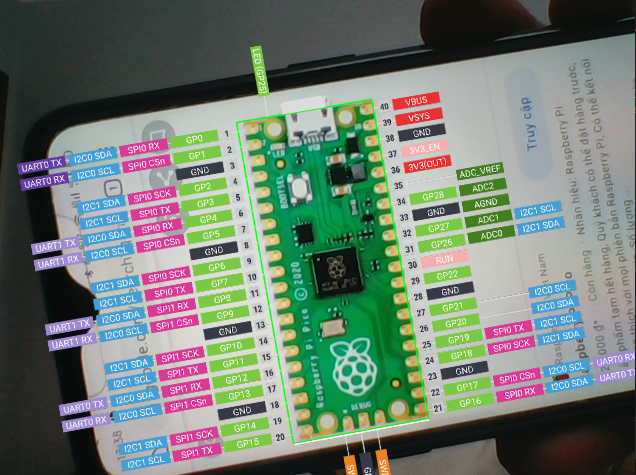

# Board AR - Overlay port labels for Raspberry Pi Pico using augmented reality

This is my project on the first day of lunar new year. The idea comes from [this 9gag post](https://9gag.com/gag/a8E4ORp).

### Screenshot

(Click image for Youtube video)

[](https://www.youtube.com/watch?v=H5MqDTnZL4E)

### How to run?

- **Requirements:**
    + Python 3
    + OpenCV

```
pip install -r requirements.txt
python main.py
```
### Note

This project is under development now.
